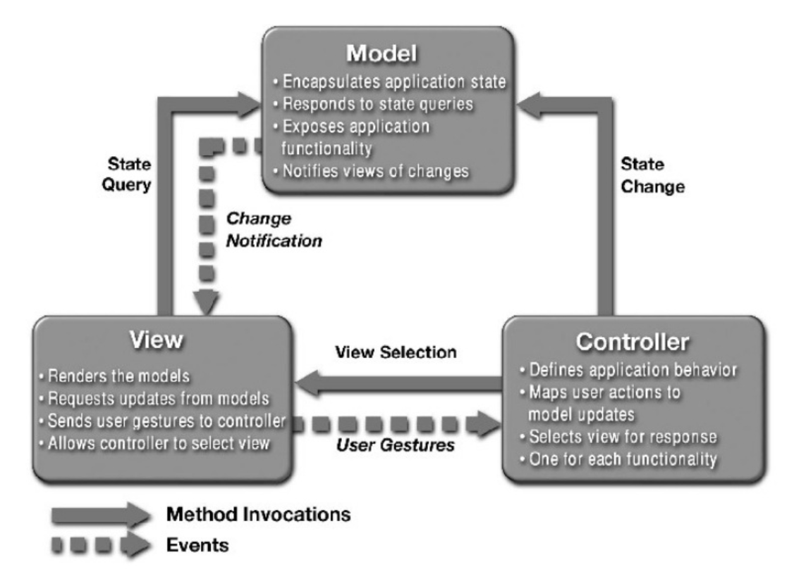
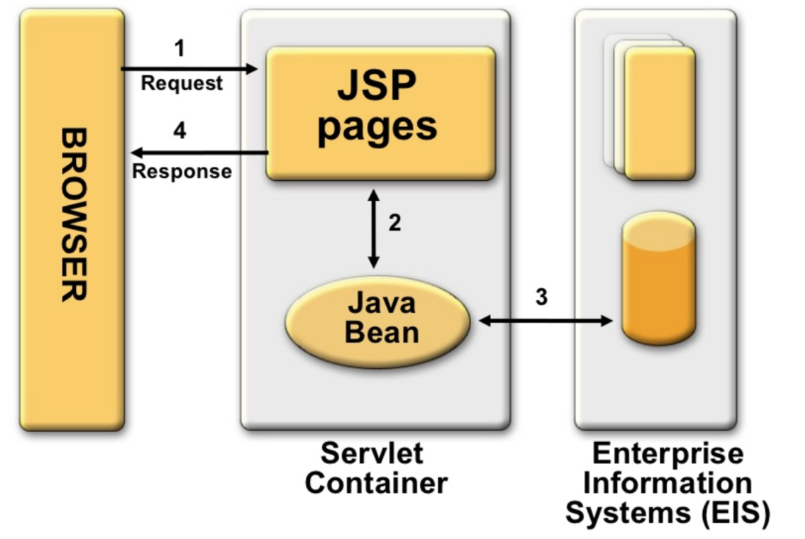
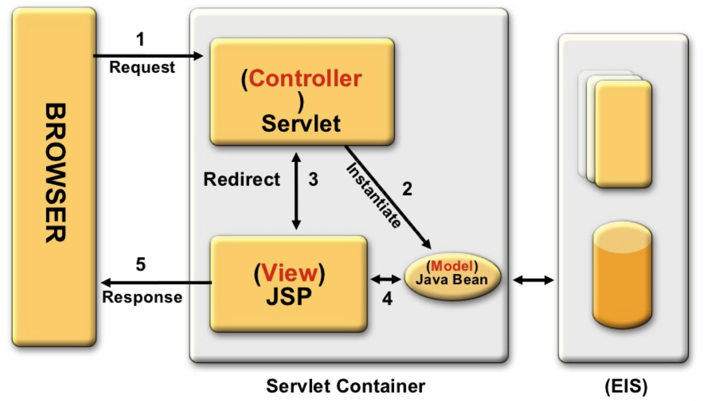

# MVC Design Pattern
MVC(Model-View-Controller)는 소프트웨어 공학에서 사용되는 소프트웨어 디자인 패턴이다. 이 패턴을 성공적으로 사용하면, 사용자 인터페이스로부터 비즈니스 로직을 분리하여 애플리케이션의 시각적 요소나 그 이면에서 실행되는 비즈니스 로직을 서로 영향 없이 쉽게 고칠 수 있는 애플리케이션을 만들 수 있다.
- 각각 맡은바에만 집중할 수 있기 때문에 `유지보수성`, `애플리케이션 확장성`, `유연성 증가`, `중복코딩 문제점` 해결

###### Model, View, Controller의 관계를 묘사하는 간단한 다이어그램. 굵은 선은 직접적인 관계를, 점선은 간접적인 관계를 나타낸다

# Controller
Model에 명령을 보냄으로써 Model의 상태를 변경할 수 있다.
또, 컨트롤러가 관련된 View에 명령을 보냄으로써 Model의 표시 방법을 바꿀 수 있다.
- Model, View에 대해서 알고 있어야 한다.
- Model, View의 변경을 모니터링 해야 한다.

# Model
Model은 Model의 상태에 변화가 있을 때 Controller와 View에 이를 통보한다. 이와 같은 통보를 통해서 View는 최신의 결과를 보여줄 수 있고, Controller는 Model의 변화에 따른 적용 가능한 명령을 추가, 제거, 수정할 수 있다.
- 사용자가 편집하길 원하는 모든 데이터를 가지고 있어야 한다.
- View, Controller에 대한 어떤 정보도 알지 못한다.
- 변경이 일어나면, 변경 통지에 대한 처리방법을 구현해야 한다.

# View
View는 사용자가 볼 결과물을 생성하기 위해 Model로부터 정보를 얻어 온다.
- Model이 가지고 있는 정보를 따로 저장해서는 안된다.
- Model, Controller의 구성 요소를 몰라야 된다.
- 변경이 일어나면 변경통지에 대한 처리방법을 구련해야 한다.

###### 웹 애플리케이션에서 일반적인 MVC 구성요소 다이어그램

# MVC Pattern Model1
Model1은 Client가 요청한 로직을 처리하는 경우이다.
JSP(Java Server Page)에서 View와 Controller의 역할을 담당하며 그 결과를 Client에게 반환한다.
이러한 구조는 단순한 페이지 작성으로 쉽게 구현이 가능하지만, 복잡해지면 모든 Client의 요청과 응답을 JSP가 담당하기 때문에 유지보수 문제가 발생하게 된다.

# MVC Pattern Model2
Model2는 Model1의 방식을 보완한 형태로, Model, View, Controller 부분으로 모듈화되었다. Client의 요청을 하나의 Servlet이 받아서 처리한 결과를 JSP 페이지로 Redirect한다. JSP는 결과 화면을 Client에게 전송한다. 현재의 Web Application은 대부분 Model2의 방식을 따르고 있다.

# Spring MVC Model
Spring MVC는 Model2 방식의 Architecture를 사용하고 있다.

- DispatcherServlet receives the request.
- DispatcherServlet dispatches the task of selecting an appropriate controller to HandlerMapping. HandlerMapping selects the controller which is mapped to the incoming request URL and returns the (selected Handler) and Controller to DispatcherServlet.
- DispatcherServlet dispatches the task of executing of business logic of Controller to HandlerAdapter.
- HandlerAdapter calls the business logic process of Controller.
- Controller executes the business logic, sets the processing result in Model and returns the logical name of view to HandlerAdapter.
- DispatcherServlet dispatches the task of resolving the View corresponding to the View name to ViewResolver. ViewResolver returns the View mapped to View name.
- DispatcherServlet dispatches the rendering process to returned View.
- View renders Model data and returns the response.

# Servlet
- Java를 사용하여 웹페이지를 동적으로 생성하는 서버측 프로그램 혹은 그 사양
- 웹 서버의 성능을 향상시키기 위해 사용되는 자바 클래스
- Servlet은 외부 요청마다 프로세스보다 가벼운 Thread로서 응답하기 때문에 가볍다.
- Java로 구현되므로 다양한 플랫폼에서 동작한다.
- 클라이언트의 요청에 따라 동적으로 모듈을 처리하고, 결과를 다시 클라이언트에게 전송하는 Class이다.
- HTTP 프로토콜 서비스를 지원한다. HTML 변경시 Servlet을 재 컴파일 해야한다.
- 자바를 사용하여 웹을 만들기 위해 필요한 기술이다.
- JSP는 HTML문서 안에 Java 코드를 포함하고 있지만, Servlet은 Java 코드 안에 HTML을 포함하고 있는 차이점이 있다.

# Servlet Container
HTTP 요청을 받아 Servlet을 실행시키고 결과를 사용자 브라우저에게 전달해주는 기능을 가진 Component이다.
- 통신 지원
- 생명 주기 관리
- 멀티스레딩 관리
- 선언적 보안 관리
- JSP 지원
- Tomcat, Jetty, JBoss, etc...
