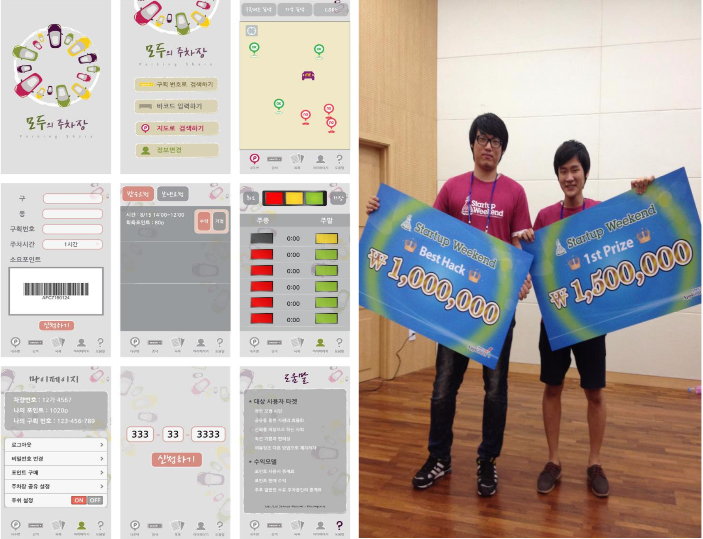

# Overview

## 무박 3일간 프로젝트를 완성하라

Startup Weekend는 기획자, 개발자, 디자이너 등 스타트업을 꿈꾸는 사람들이 모여 주말동안 새로운 아이디어를 발굴하고 서비스로 구현시키는 글로벌 해커톤이다.

2012년 9월 14일부터 16일까지 서울에서 제 8회 Startup Weekend 행사가 진행되었다. 개발자, 디자이너, 기획자가 팀을 이루어 무박 3일동안 하나의 서비스를 구현하는 것을 목표로 행사는 진행되었다.

서울지역의 거주자 주차공간이 낮시간에 많이 비어 있다는 점에 착안하여 빈 주차장을 검색하여 주차구역의 주인에게 일정 시간 주차 공간을 대여할 수 있는 앱을 구현하였다. 실제 DB를 불러오는것부터 대여 기능 그리고 지도상의 구현까지 기술적으로 완성도 높은 앱을 선보였고, 무엇보다도 사람들이 가장 필요로하는 앱을 만들었다는 것에 심사위원이 수여하는 1등상과 참가자들이 모바일로 투표하는 베스트핵상을 모두 받을 수 있었다.


###### 제 8회 Startup Weekend 영상 [^1]

# Problems

## 처음으로 시작한 개발

개발자 신분으로 Startup Weekend 행사에 참가했다. 같이 개발하는 친구와 함께 행사에 참가하여 지금은 '모두의 주차장'의 대표가 된 강수남님의 아이디어를 듣고 친구와 함께 강수남님의 개발자 팀원으로 합류하였다. 총 8명의 팀원으로, 개발자 3명, 기획자 4명 그리고 디자이너 1명으로 프로젝트를 시작하게 되었다.

아이디어는 다음과 같다. 주로 낮 시간에 비어있는 주차 공간을 필요한 사람들에게 제공해줘서 주차 공간의 효율성을 높이자는 취지의 아이디어였다. 이러한 이유로 앱 서비스의 이름은 주차의 문제점을 해결하고, 비어있는 주차 공간을 공유하자라는 의미로 '모두의 주차장'이라는 이름을 가지게 되었다.

문제는 2박 3일이라는 짧은 시간 동안 최소한의 기능을 모두 담은 앱 서비스를 개발해야하는 상황이 주어졌다는 것이다. 개발 일정상 불가능의 상황에서도 유의미한 결과를 만들기 위해 밤잠을 새가면서 실제 구현할 수 있는 단계를 파악하고, 같이 개발하는 구성원들과 긴급한 문제부터 빠르게 해결하면서 개발을 진행했다.

그 결과 짧은 기간 동안 개발되었지만 복잡한 구조와 러닝 커브가 큰 기술들을 사용하는 것을 지양하면서 핵심적인 기능들을 모두 담아내는 Mobile App을 만들 수 있었다. 이런 과정을 통해 만들어진 '모두의 주차장'이라는 앱 서비스는 타 팀에 비해 기술적 완성도와 사업성이 모두 훌륭하다고 평가되어 대회 최초로 대상과 참가자 투표로 이루어진 BestHack(최고 개발상)을 동시에 수상할 수 있었다.

###### 주차 공유 서비스 모두의 주차장. 오랜 친구 김동기와 함께

[^1]: 영상 출처 [유튜브](https://www.youtube.com/watch?v=ct-ZXR739c4)
