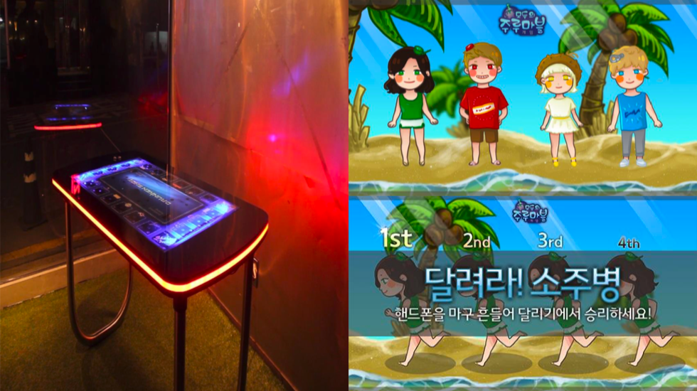
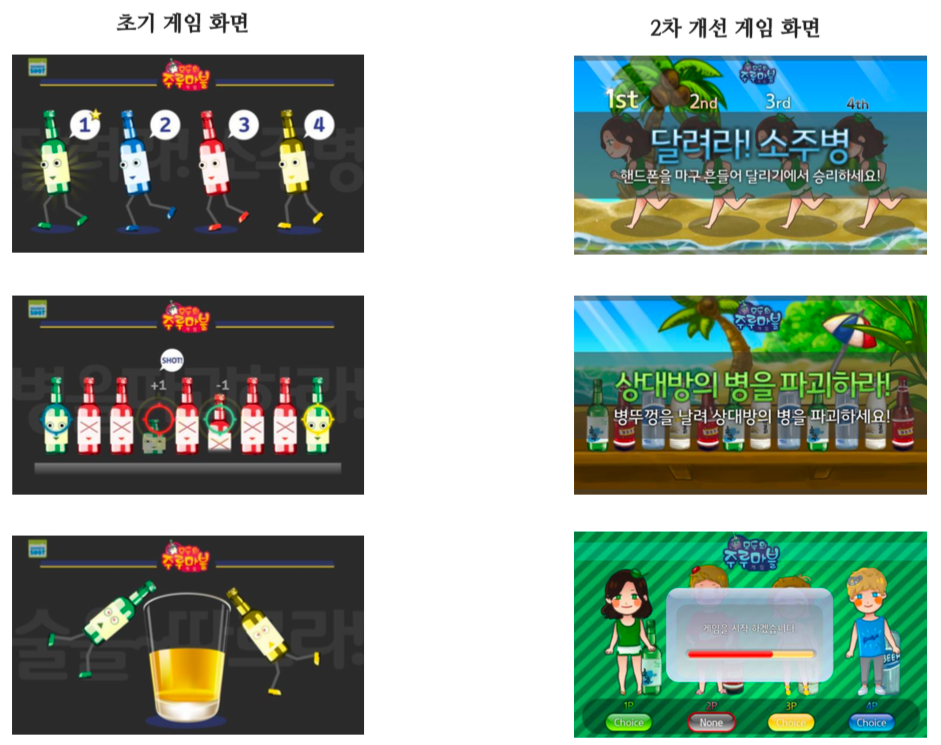
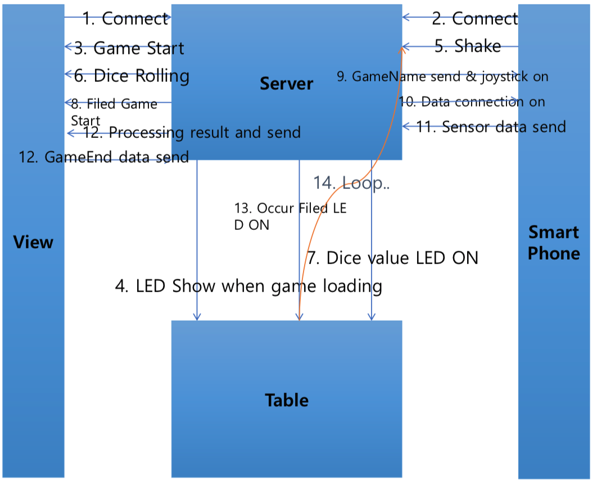
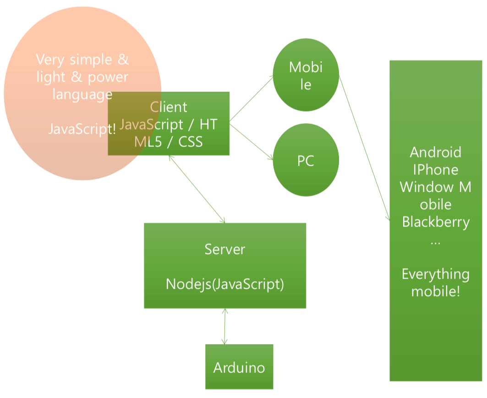
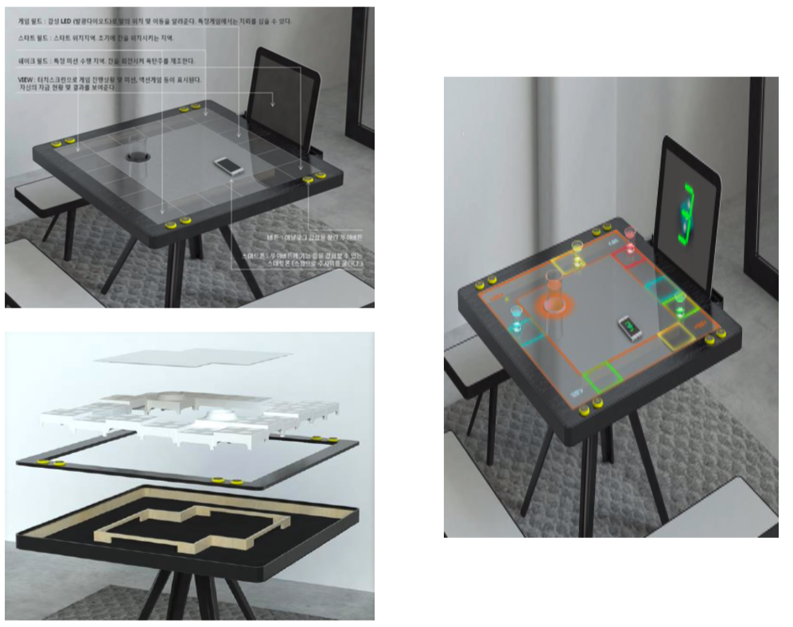
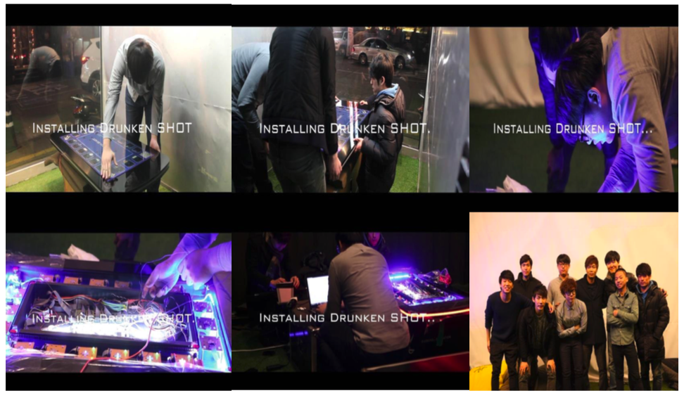
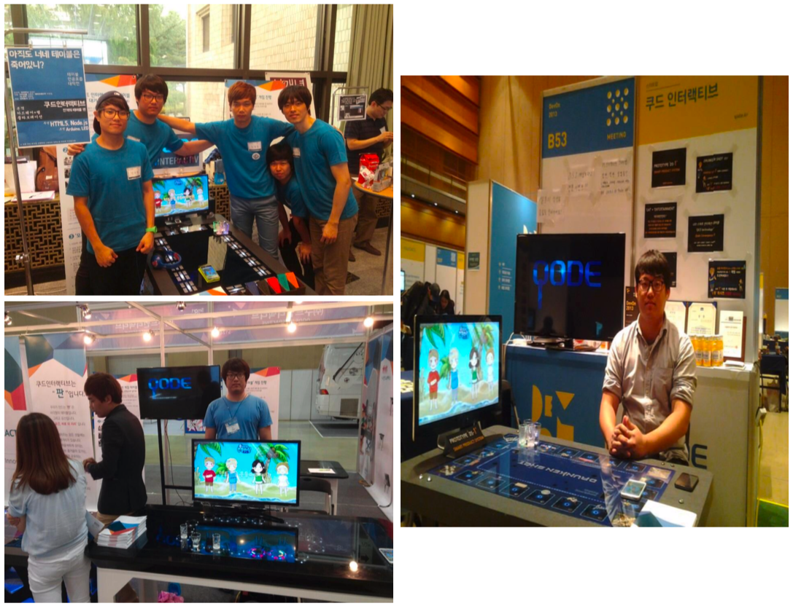
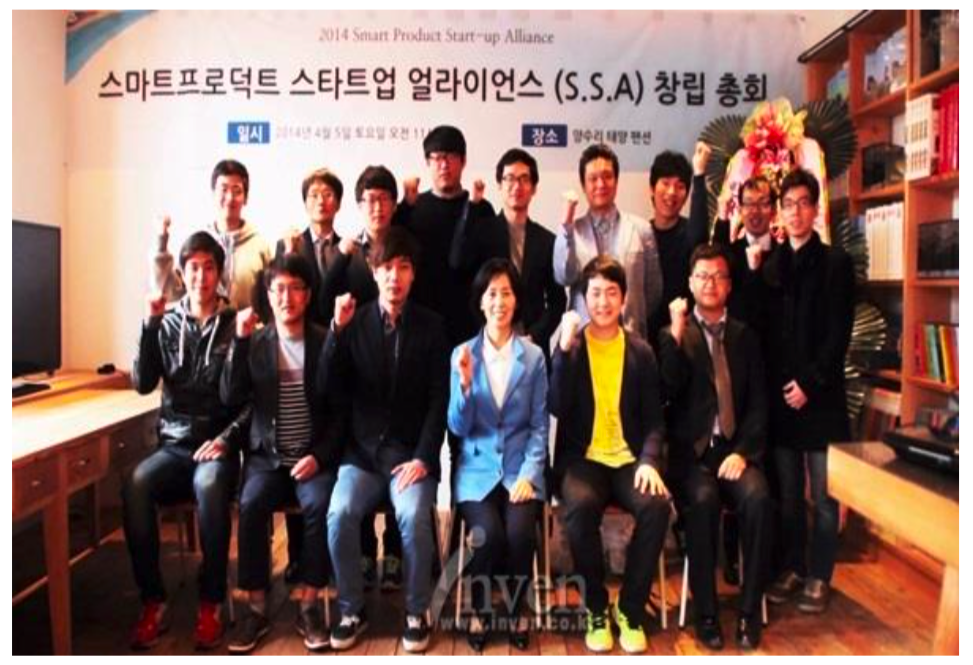

# Overview

## 먹고 마시면서 즐길 수 있는 스마트한 게임 테이블

Qode Interactive는 먹고 마시면서 즐길 수 있는 스마트 인터랙션 게임테이블을 개발하기 위해 코파운더로 2013년에 김성은 대표와 같이 창업한 회사입니다.

스마트 인터랙션 게임테이블이란 사용자의 스마트폰을 조이스틱으로 사용하여 게임을 즐길 수 있는 스마트한 게임 테이블입니다.

###### 게임테이블 화면

###### 게임 화면의 변화

###### 스마트폰으로 Web을 통해 게임에 접속하여 테이블 안에 있는 하드웨어 장치와 연동하는 방식 (스마트폰을 조이스틱으로 활용)

###### 별도의 App설치를 하지 않고 Web을 통해 접속하기 때문에 Android, iOS모두 같은 화면으로 접속 가능 Server에서 SmartPhone과 Hardware와 연동한 통신을 함 (DrunkenShot 테이블 내부의 여러 HW장치들과 연동함)

###### 초기 아이디어 기획을 바탕으로 디자인을 구상한 테이블 디자인

###### 논현동 플래툰 쿤스트할래에서 제품을 전시함


###### Smart DrunkenShot Game Table Concept 영상 [^1] (논현동 플래툰 쿤스트할래)

###### DaumDevon2013, 프라이머 데모데이, Coex, CES2016 전시 전시회 이후 관람객들의 반응을 블로그를 통해 피드백 받을 수 있었음


###### Coex 전시회 영상


###### Coex 전시회 인터뷰 영상

###### 스타트업 얼라이언스 창립 멤버 특성화고, 일반고, 특목고 3개의 고등학교와 협약 후, 기술 및 창업 멘토링 [관련 기사 주소](http://www.datanet.co.kr/news/articleView.html?idxno=72077)

### 수상내역
- 2014년 7월 제3회 KOTRA 나는 글로벌 벤처다 동상
- 2014년 9월 2014 GMV 이노베이션 혁신상 금상 
- 2014년 5월 미래창조과학부 창조경제타운 6기(우수 아이디어 제품)
- 2014년 9월 SK Telecom 브라보 3기(TOP 20)
- 2014년 12월 2014 VIP ASIA Awards 수상 
- 2014년 12월 2014 AVING 뉴 게임 시스템 부문 수상
- 2015년 11월 KOTRA 제1회 START 선전 IR 프로그램(TOP 10)
- 2015년 12월 한양대학교 LION CUP 특별상
- 2015년 12월 경기창조경제혁신센터 K-CHAMP 2기 선정
- 2016년 6월 경기창조경제혁신센터 우수 기업 선정
- 2017년 4월 2017 INNO-CHINA 대상
- 2017년 4월 2017 서울경제포럼(한중 포럼) IR 대표 기업 선정
- 2017년 12월 2017 한국ICT융합기술협회 융합기업인상 수상

[^1]: 영상 출처 [유튜브](https://youtu.be/UDDtN8cwZJk)
