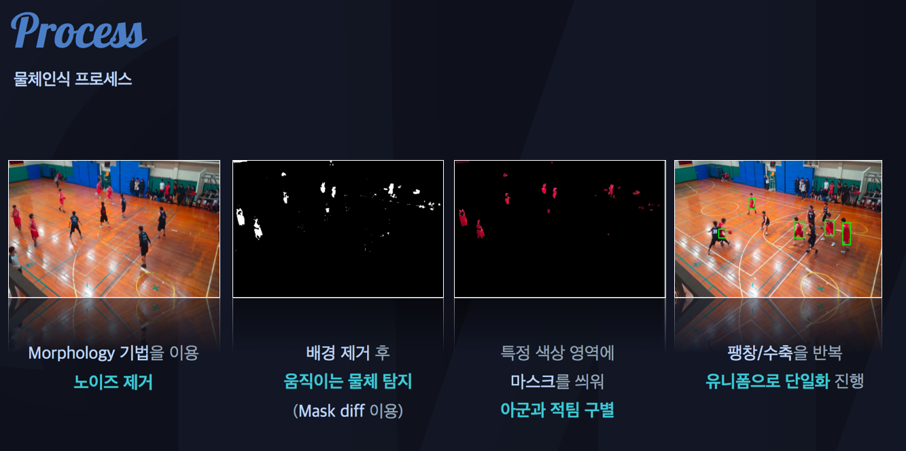
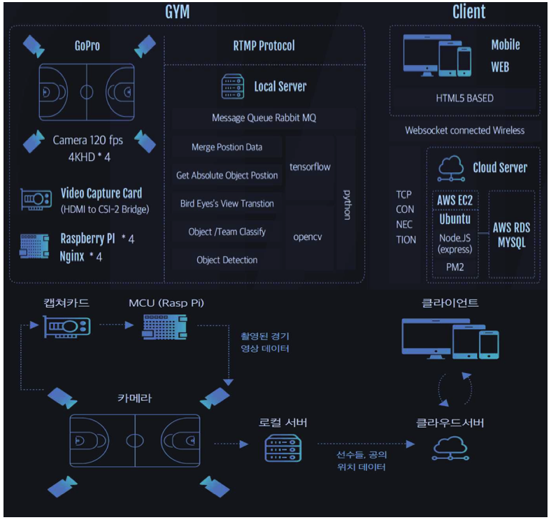
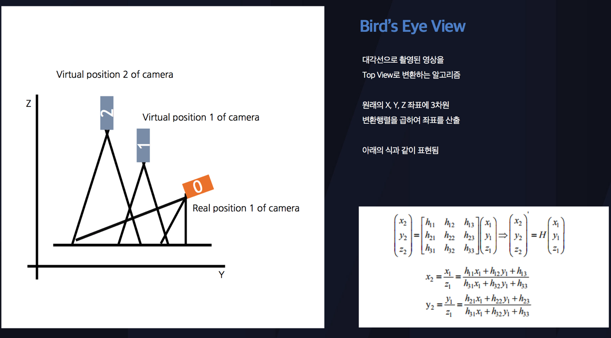
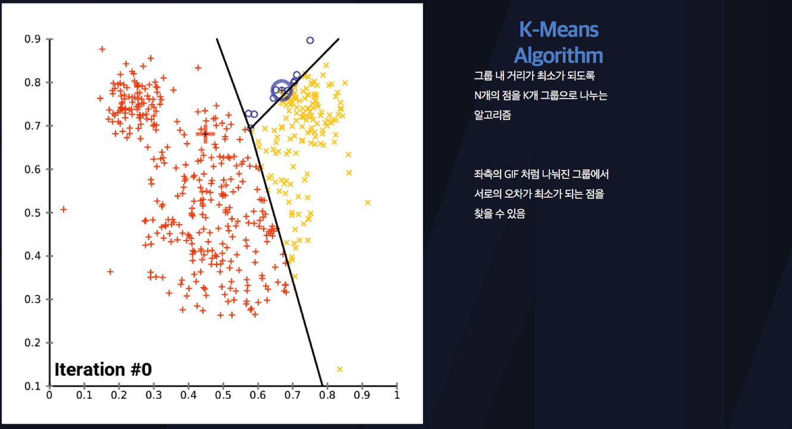

# Overview

## 소프트웨어 마에스트로 8기 수료

소프트웨어 마에스트로는 최우수 SW인재를 발굴하여, 체계적이고 파격적인 지원을 통해 SW산업 발전에 기여하기 위해 기획된 정부지원 사업이다.

과학기술정보통신부와 정보통신기술진흥센터에서 주관하고, 한국정보산업연합회에서 운영하는 과정으로 국내 소프트웨어 전문가들을 만들자는 취지하에 운영되고 있다.

소프트웨어 산업 분야별 전문가를 멘토로 지정하여 도제식 교육방식을 통해 단계별 프로젝트를 수행하면서 지도받는 시스템이다.


###### 초기 Watch Coach 소개 영상 [^1]

## 우리팀만의 스마트 전술감독 Watch Coach
최근 스포츠 분야에서 IT 기술의 접목이 많이 이루어지고 있다. 태릉선수촌과 같은 프로팀이 아닌 아마추어팀들에게는 IT 기술을 이용한 스포츠 분석 시스템이 턱없이 많은 비용이 들어가며 전문적으로 관리해줄 수 있는 전문가도 필요한 실정이다. 따라서 아마추어 팀들이 사용하기 적합한 저가형 팀 스포츠 전술 모니터링 시스템 설계를 고안하게 되었다.

## Technical Specifications
1. 영상처리를 기반으로 한 실시간 선수 위치 표시
    - 전체적인 선수들의 움직임을 실시간으로 표시
    - 작전타임에는 표시되는 선수들의 위치를 바탕으로 전술판으로 활용
2. 수비 & 공격 범위 표시
    - 수비 영역과 공격 영역에 대한 범위를 표시
    - 수비 영역과 공격 영역을 기반으로 팀 전술 분석
3. 통계 및 분석 기능
    - 수동으로 관리되는 선수 개개인의 점수와 기량을 데이터베이스화
    - 데이터들을 기반으로 팀에 해당되는 적절한 전략 전술을 추천해줌
4. 다시 보기 기능
    - 언제든지 촬영된 영상들을 다시 볼 수 있음


###### Watch Coach 홍보 영상 [^2]

###### [Watch Coach LIVE 화면을 보고 싶다면 클릭!](http://35.196.80.208/2.%EC%99%93%EC%B9%98%EC%BD%94%EC%B9%98%20live.pdf)

## Comparison with Other Service
기존의 스포츠 분석 시스템의 경우 설치 및 유지 비용이 연간 1억 5천만원에 달하는 비용과, 설치 후 이를 전문적으로 분석해줄 수 있는 별도의 분석 전문가가 필요하다. 더군다나 자동이 아닌 수동으로 분석이 필요하다는 단점이 있다. `Watch Coach` 분석 시스템은 감독이 없는 아마추어 팀들을 위한 분석 장비로서 촬영된 영상을 바탕으로 별도의 영상처리 분석 알고리즘으로 선수 개개인을 구별하고, 분석을 통해 얻어지는 데이터들을 기계학습을 통해 각 팀에 알맞은 스포츠 전략 전술을 자동으로 추천해줄 수 있는 차별성을 가지고 있다.

전 세계적으로 스포츠 시장은 IT 기술과 접목되면서 지속적으로 성장세를 보이고 있다. 실제로 다양한 스포츠 분야에서 활용되고 있는 분석 시스템은 상대팀에 대한 대비, 팀과 선수에 대한 데이터베이스 구축을 통해서 경기력 향상과 선수들의 기량 향상에 도움을 주고 있습니다. 하지만, 이러한 기존의 분석 시스템들은 고가의 제품이고, 제품과 함께 전문가가 항상 분석을 같이 해주어야하기 때문에 아마추어 팀은 시스템을 이용할 수 없습니다. 지능형 팀 스포츠 경기 분석 시스템 Watch Coach는 저가의 소프트웨어로 선수들의 전체적인 동작 및 기량을 영상처리를 기반으로 손쉬운 시각화 작업을 통해 효율적인 훈련 관리를 가능하게 해줍니다.

## Technical
1. 적 팀과 아군 팀의 구분
    - Morphology 기법을 이용하여 이미지 노이즈를 제거하고 불필요한 배경을 제거 후 움직이는 물체를 Mask Diff를 이용하여 탐지한다. 특정 색상 영역에 마스크를 씌워 팀을 구분해낸다. 또, 마스크된 영역을 팽창과 수축을 반복하여 유니폼으로 단일화를 진행한다.

###### Morphology 기법을 이용한 팀 구분
2. 영상 처리 최소화
    - 새로운 영상으로 렌더링하지 않고, 위치 데이터만을 아이콘화하여 표시, 분석된 선수들의 위치 정보는 서버에 캐싱 후 모든 영상으로부터 위치 정보를 분석하여 데이터베이스에 삽입한다.

###### Watch Coach 시스템 구조
3. 다중 카메라 시점 위치 동기화
    - 4대의 카메라에서 Transparent View한 영상을 바탕으로 사각지대 없이 촬영한다. 4대의 카메라를 동기화하여 Tensorflow를 이용한 Object Tracking을 실시한다.
4. Bird's Eye View
    - OpenCV를 이용하여 영상데이터를 평면화(Straightening) 후 2차원 좌표평면 상에 인식된 Object의 위치를 영사시켜 표현해준다.

###### Bird's Eye View
5. K-Means Algorithm
    - 다수의 카메라가 특정 Object에 대해 Tracking하고, 이를 2D 평면상에 위치 좌표화하는 과정에서 발생하는 오차를 조정 및 보정해주는 알고리즘

###### K-Means Algorithm
6. Ransac Algorithm
    - 영상을 변환하는 과정에서 생기는 왜곡과 카메라의 왜곡을 보정하여 좌표의 오차율을 낮추는 알고리즘
7. Tensorflow Object Detection
    - Tensorflow 및 OpenCV를 이용하여 기계 학습을 바탕으로 유사 데이터를 분석하고 정확성을 향상시킨다.

###### [Watch Coach 기반으로 작성된 논문 -> 지능형 다중 카메라 기반 스포츠 선수 코칭용 원격 전술 모니터링 시스템](http://35.196.80.208/%EC%A7%80%EB%8A%A5%ED%98%95%20%EB%8B%A4%EC%A4%91%20%EC%B9%B4%EB%A9%94%EB%9D%BC%20%EA%B8%B0%EB%B0%98%20%EC%8A%A4%ED%8F%AC%EC%B8%A0%20%EC%84%A0%EC%88%98%20%EC%BD%94%EC%B9%AD%EC%9A%A9%20%EC%9B%90%EA%B2%A9%20%EC%A0%84%EC%88%A0%20%EB%AA%A8%EB%8B%88%ED%84%B0%EB%A7%81%20%EC%8B%9C%EC%8A%A4%ED%85%9C.pdf)

### 수상내역
- 2018년 9월 경희대학교 2018 창의적 종합설계 경진대회 최우수상(교내)
- 2018년 10월 2018 공학교육혁신선도대학 창의적 종합설계 경진대회 금상(지역)
- 2018년 11월 2018 창의적 종합설계 경진대회 한국산업기술진흥원장상(전국)
- 2018년 11월 경희대학교 SW페스티벌 인기상
- 2018년 11월 경희대학교 SW페스티벌 최우수상
- 2018년 11월 경희대학교 SW페스티벌 대상
- 2018년 12월 SW인재페스티벌 우수 작품 경진 대회 과학기술정보통신부장관상
- 2018년 12월 창의메이커스필드 '4차 산업혁명시대 SW활용 경진대회' 한국3D프린팅서비스협회장상

[^1]: 영상 출처 [유튜브](https://youtu.be/goom4QwFLjg)
[^2]: 영상 출처 [유튜브](https://youtu.be/C_vkRyjfp3U)